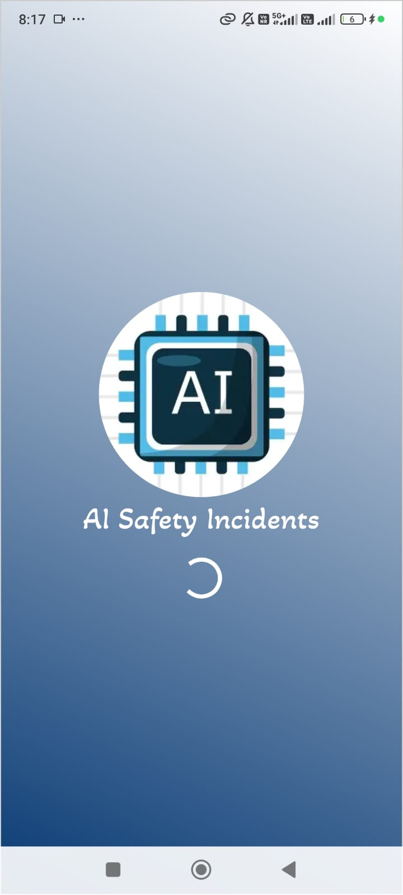
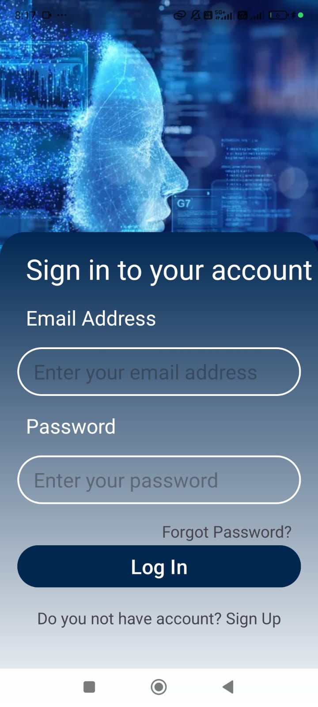
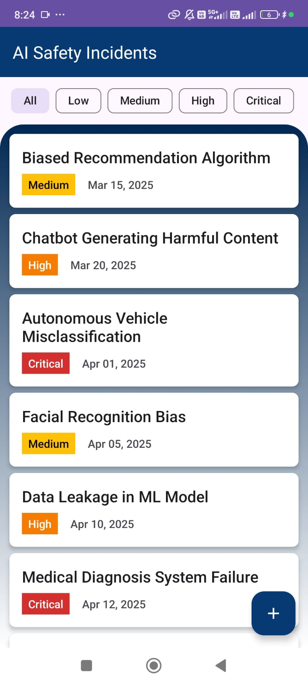
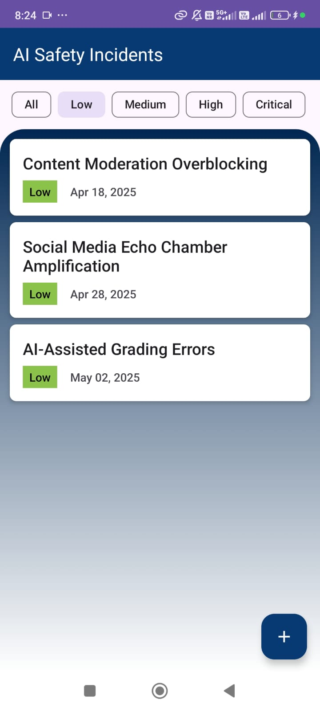
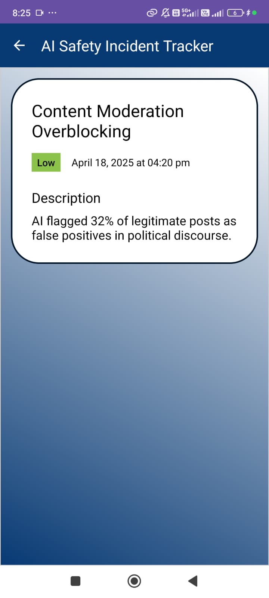
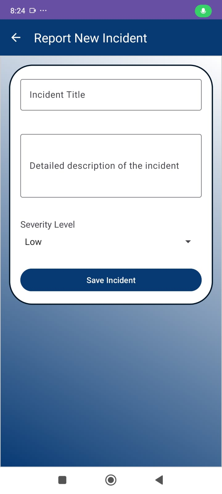

# 🚀 AI Safety Incident Tracker - Android App

## 📝 Overview
**AI Safety Incident Tracker** is a clean and simple **Android (Kotlin)** application developed for the **SPARKLEHOOD Assessment**.  
The app empowers users to **view**, **filter**, **add**, and **report** AI safety incidents with a focus on **intuitive interaction**, **state management**, and a **polished UI**.

✨ Bonus features:
- Elegant **Splash Screen** for a smooth start.
- **Signup/Login** system using **SharedPreferences** for session handling.

---

## 🌟 Features

- 🚀 **Splash Screen** with seamless transition to authentication.
- 🔐 **User Authentication**: Signup and Login (locally managed via SharedPreferences).
- 📜 **Incident Feed**: Scrollable list with **RecyclerView** and stylish **CardView** layouts.
- 🎯 **Filter by Severity**: Quickly filter incidents using a **Spinner** dropdown.
- 📄 **Detailed View**: View complete incident details — Title, Severity, Date, Description.
- ➕ **Report New Incident**: Add incidents easily via a simple form (with Severity selection).
- 🕒 **Auto-generated Report Date**: Current date-time auto-filled on incident creation.
- 🧹 **Modern & Clean UI**: Built with Material Design principles.

---

## ⚙️ Tech Stack

- Kotlin
- Android SDK
- SharedPreferences (for authentication)
- RecyclerView & CardView (for incident list)
- Spinner (for filtering)
- Material Components (for FAB, EditText, Buttons)

---

## 🛠️ How to Build & Run Locally

1. **Clone the Repository**
   ```bash
   git clone https://github.com/your-username/ai-safety-incident-tracker.git

## 📸 App Screenshots

<p align="center">
  
  
  
</p>
<p align="center">
  
  
  
</p>

## 📬 Contact
If you have any queries or feedback, feel free to reach out!

# 🎉 Thank you for checking out AI Safety Incident Tracker!
